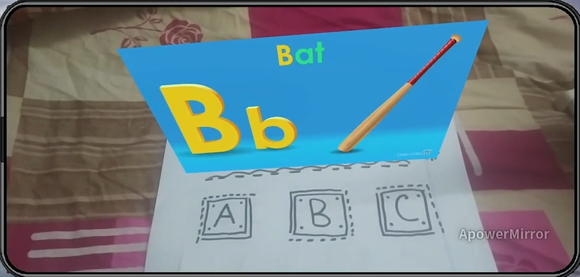

# Augmented-Reality-App

CSE332 ( 2017331029 and 2017331101 )

---

# Why this project?

We were interested in augmented reality based apps. And this is our first AR app. We tried to implement multiple virtual buttons on multiple target images with virtual screen(video).

Children find it more interactive and fun to see virtual objects on e real paper and interact physically . It will help them learn new things interestingly with audio and augmented video.

# Features

This is an augmented reality app which uses target images to do specific tasks. In this app we used virtual buttons and virtual 2D screens. There are many virtual buttons with a corresponding virtual screen for each . The virtual buttons are virtually clicked and their behaviour  is determined by C#  scripts .

---




---

# Dependencies 

* Windows 10 
* Visual Studio Community Edition 2019
* Unity 2020.3.24f1
* Unity Vuforia package 10.3.2
* Android SDK 9.0 (API 28 ) or above
* Android phone with AR Support

---

# Building this project 

Clone this repository :

Step 1 :

```bash
    https://github.com/Sumon2017/augmented-reality-app.git
```

Step 2 :

If you want to manually add library and packages then download Library.zip and Packages.zip files from the following links.


[Library.zip](https://drive.google.com/file/d/1RC782V1g8nUehCksZJ6UZNbqzwna3HED/view?usp=sharing
)

[Packages.zip](https://drive.google.com/file/d/1O87O5oLT2ADG1hbtz3wKzU3Eyx7nDgDX/view?usp=sharing
)

links are also given in library-link.txt and package-link.txt files of this repository.

Step 3 :

Open this project in unity and do the following for building the apk yourself .

File >> Build Settings >> Build

an prebuilt apk file is also provided in this reository (ARedu2.apk)

---

# How to run it 

Install the apk in your AR supported phone .

You need to print out the two target papers given in target-images folder.

Open the app and place the camera over the printed papers. It will take some time to recognize and proccess . After the virtual 2D screen appears then you can click the buttons virtually. 

---

# Embedded Presentation 

[](https://www.youtube.com/watch?v=V8nryTX7vPU)

